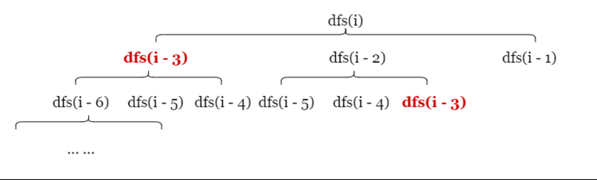
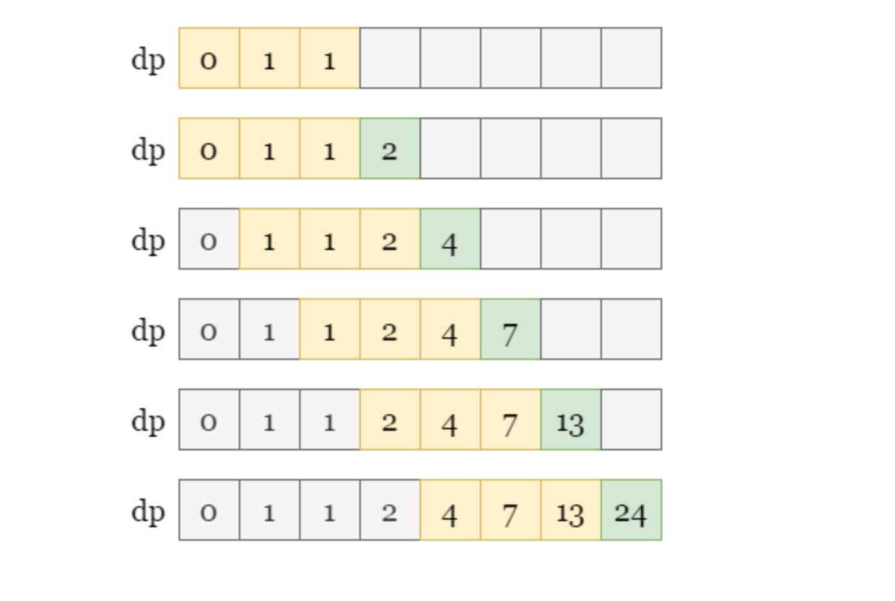
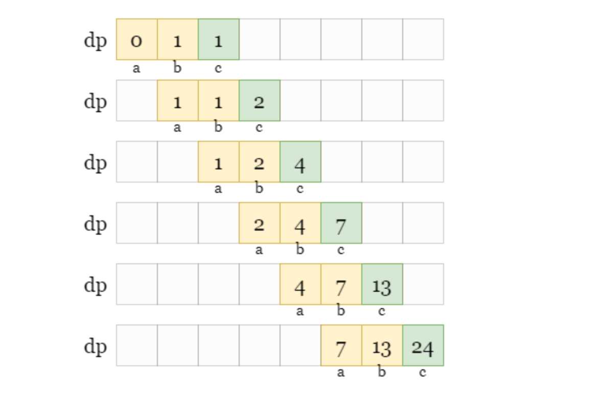

# Solution

## Dynamic Programming(Top Down)

Let `dfs(i)` be the value of the `iᵗʰ` tribonacci number, and according to the given recurrence relation, we have:  
`dfs(i) = dfs(i-1) + dfs(i-2) + df(i-3 )`.  

Note that the solution to the current problem `dfs(i)` can be built from the solutions to its subproblem (`dfs(i-1)`, `dfs(i-2)`, `dfs(i-3)`). Dynamic Programming is exactly based on the concept of **overlapping subproblem** and **optimal substructure**, thus it can be a powerful tool to solve this problem efficiently.  

> For example, suppose we are given `n=5`. we have `dfs(5) = dfs(4) + dfs(3) + dfs(2)` according to the recursion relation.  
>
> However, we don't know the values of `dfs(4)` or `dfs(3)`, so we need to continue referring to the recursion relation, first on `dfs(4)`: `dfs(4) = dfs(3) + dfs(2) + dfs(1)`.  
>
> We don't know the value of `dfs(3)` either, continue referring to the recursion relation: `dfs(3) = dfs(2) + dfs(1) + dfs(0)`.  
>
> Great, now we have some known solutions, as the values of the first three tribonacci numbers are given in the problem description:  
> - `dfs(0) = 0`
> - `dfs(1) = 1`
> - `dfs(2) = 1`
>
> With these base cases, we can find `dfs(3)`. Once we have `dfs(3) = 2`, this allows us to find the answer of `dfs(4)`, and then finally `dfs(5)`.  

In general, we recursively break the current problem down into subproblem, until we reach the base cases: the first three tribonacci numbers.  

For these base cases, we don't need further recursion. for any other `i>2`, we can refer to the recurrence relation above. since the subproblem always had a smaller `i` than the current problem, we are guaranteed to eventually reach base cases.  

However, we notice that the same `dfs(i)` may be calculated multiple times. to avoid the high time complexity caused by repeated calculations, we can use a hash map `dp` to save results. this is a technique called memoization.  

  

In later calculations, if we find that `dp[i]` already exists, we know that we have already computed the value of `dfs(i)`, and we can simply return the precomputed solution `dp[i]` without further recursion. this can significantly reduce the computational time and make the algorithm more efficient.  

## Dynamic Programming(Bottom Up)

Different from the previous recursive approach that breaks the problem into subproblem, we can also start from the subproblem and gradually build up to the larger ones until reaching the final problem dfs(n). this approach is called bottom-up dynamic programming.  

Suppose we let the function `f(i)` represent the value of the `iᵗʰ` tribonacci number, according to the description, we have the following relation:  
`f(i) = f(i-1) + f(i-2) + f(i-3)`.  

Each problem `f(i)` is related to three subproblem. thus we can store tribonacci numbers in an array `dp` where `dp[i]` represent the `iᵗʰ` term. then we can then iterate through the index `i` and calculate each term using the given related, as shown in the picture below.  
`dp[i] = dp[i-1] + dp[i-2] + dp[i-3]`.  

  

One advantage of this solution is that we precompute each tribonacci number. if we have multiple requests on the value of the `iᵗʰ` tribonacci number later, we can simply refer to `dp[i]` in a constant time, rather than computing `dp[i]` again. this method is called tabulation.  

## Better Dynamic Programming(Bottom Up)

The previous solution requires `O(n)` space complexity since we store all visited tribonacci numbers in `dp`, let's optimize it.  

Note that the value of each tribonacci number only depends on its three previous terms, and the terms before that do not affect its value. therefore, its unnecessary to store all the terms. instead, we only need to store the three most recent tribonacci numbers, let's call them `a`, `b`, and `c`. then, the next tribonacci number is simply `a + b + c`.  

Afterward, we update `a`, `b`, and `c` as the most recent three tribonacci numbers:  
- `a = b`
- `b = c`
- `c = origin a + origin b + origin c`  

We can continue obtaining the value of the next term using the same method of `a + b + c`. this approach only requires constant space complexity, as shown in the picture below.  

  
