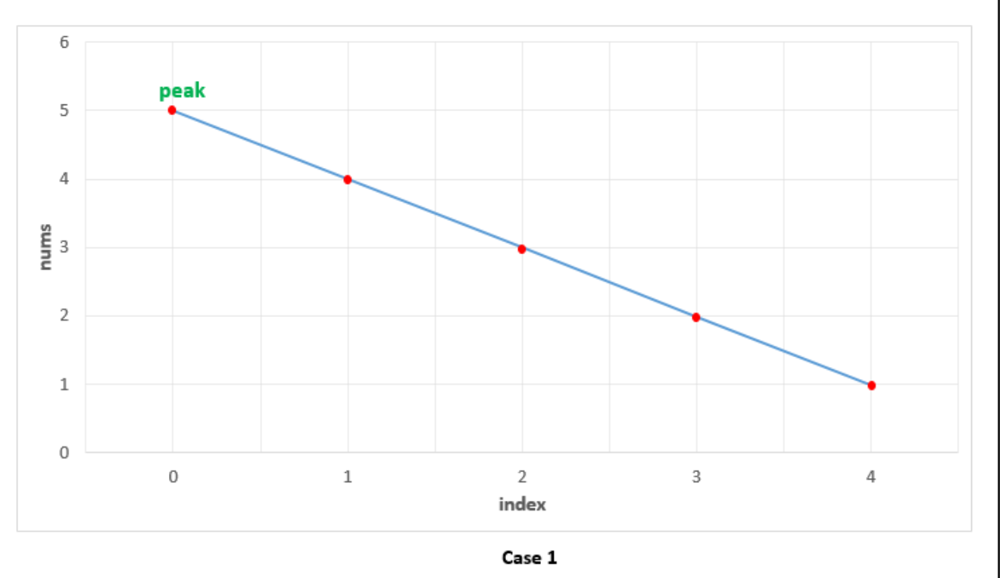
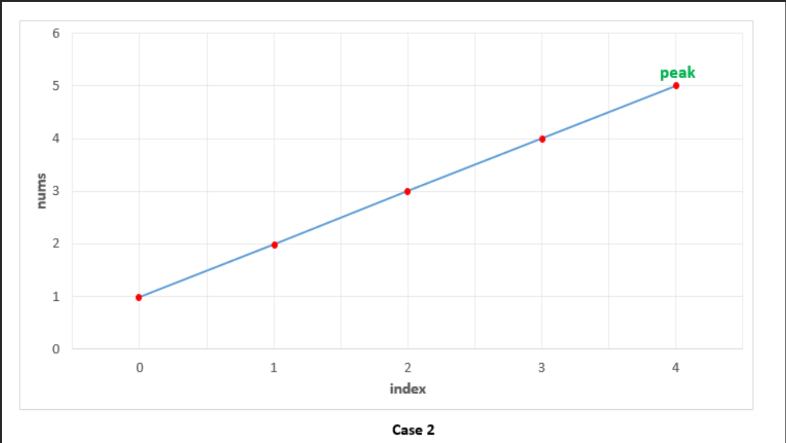
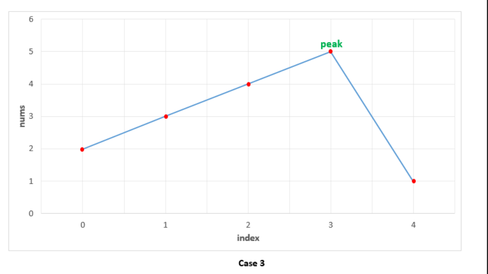
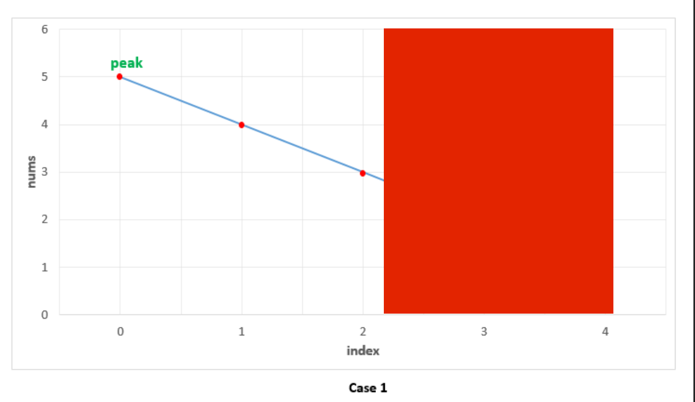
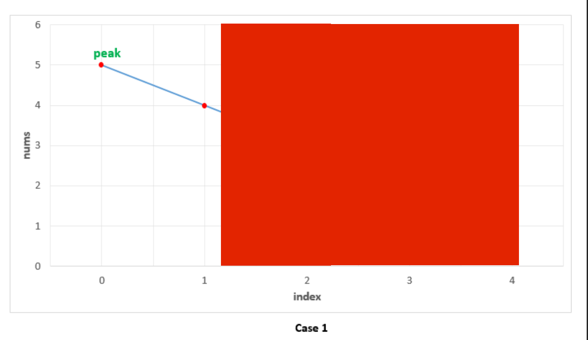
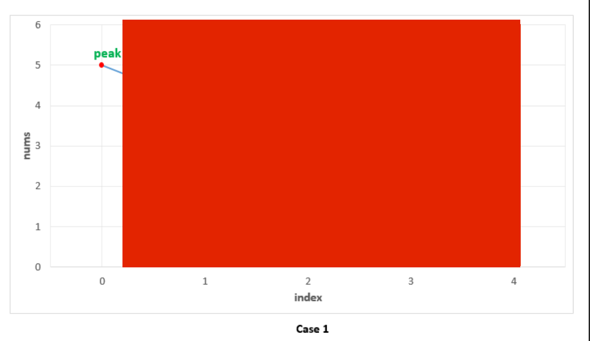
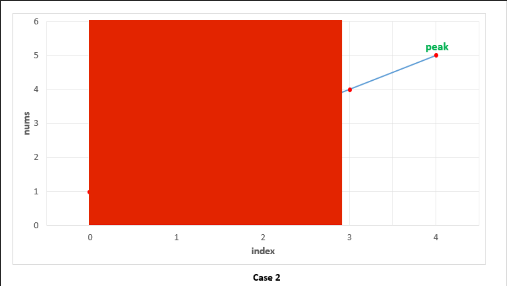
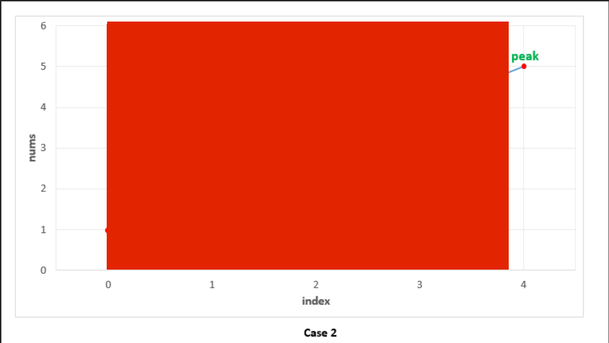
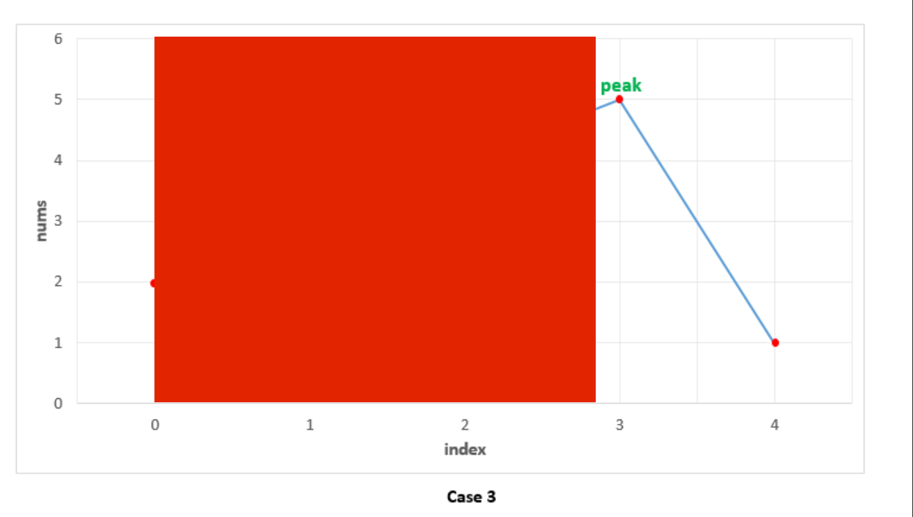
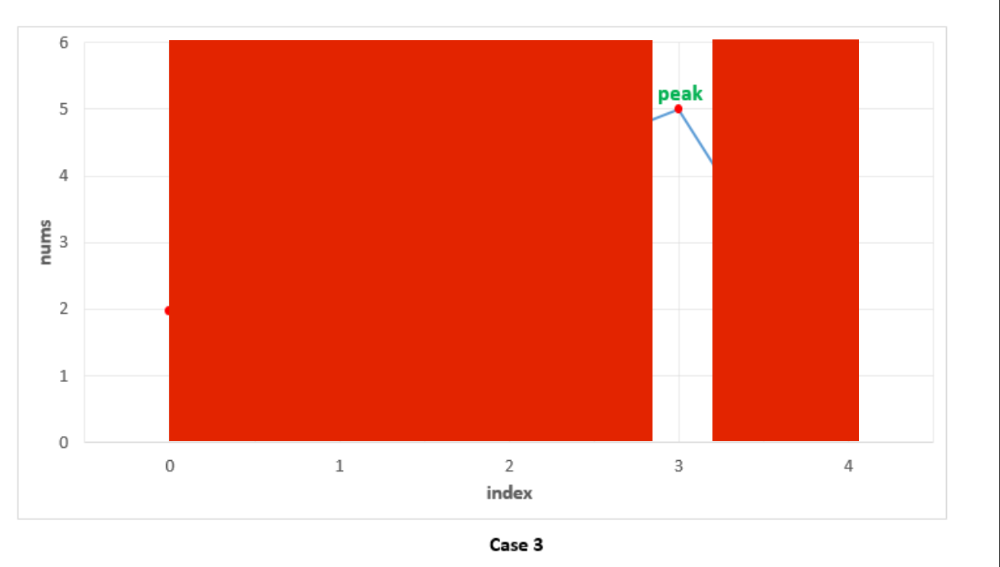

# Solution

## Linear scan

**Case1**  
nums 是降序排列的數組，在這種情況下，第一個數字應為 peak element 。我們首先檢查當前元素是否大於下一個元素，因第一個數字滿足條件，所以被視為 peak element 。在這情況下，我們不需要比較 nums[i-1] 與 nums[i] 用來判斷是否為 peak element 。  
  

**Case2**  
nums 為升序排列的情況下 peak element 為最後一個元素，我們依然只要檢查當前元素是否大於下一個元素即可判斷 peak element 。然而，升序的情況下，沒有一個元素滿足條件，所以需要返回最後一個元素作為 peak element 。這種情況下也不需要比較 nums[i-1] 與 nums[i]。  
  

**Case3**  
peak element 出現在中間某處。這種情況下，當我們升序的階段（index 0~3）時，沒有一個元素滿足 nums[i] > nums[i+1] ，就像 case2 我們不需要比較 nums[i-1] 與 nums[i] ，因為當滿足 nums[i] > nums[i+1] 條件時，它就是 peak element 。  
  

## Recursion and binary search

我們可以將 nums 視為升序和降序交替的數組，因為只要返回任一 peak element ，所以我們可以利用二分搜尋找到 peak element 。  

首先從 nums 找出中間元素 mid ，如果該元素恰好位於降序的數組中或是 nums 中局部的降序數組中（透過 mid 是否大於下一個元素的判斷而發現），這意味 peak element 位於 mid 的左側。因此我們將搜尋範圍縮小到 mid 的左側（包含 mid 本身），並對左側數組執行相同的流程。  

如果 mid 位於升序的數組（透過 mid 是否大於下一個元素判斷而來的），則意味著 peak element 位於右側，因此我們把搜索範圍減少到 mid 右側，並對右側數組執行相同流程。  

用這種方式逐漸縮小搜索範圍直到最終搜索的範圍只剩一個元素的狀態，這個元素就是 peak element 。  

為了瞭解它是如何運作的，我們再次觀察剛剛的三種情況。  

**Case1**  
在這情況下，我們首先找到 index 2 為 mid ，由於它位於降序的數組中（因為 mid 大於下一個元素），所以我們將搜尋範圍縮小至 [0, 1, 2] 。  
  

從 [0, 1, 2] 可以找出 mid 為 index 1 ，由於它位於降序的數組中，所以我們將搜尋範圍縮小至 [0, 1]。  
  

[0, 1] 的 mid 為 index 0 ，由於仍位於降序數組，所以將搜尋範圍縮小至 [0]。  
  

由於搜尋範圍 [0] 只剩一個元素，所以 index 0 為 peak element 。   
  

**Case2**  
這情況下，首先找到 mid 為 index 2 ，由於 mid 位於升序數組中（mid 小於下一個元素），所以將搜尋範圍縮小至 [3, 4]。  
  

[3, 4] 的 mid 為 index 3 ， mid 仍處於升序數組，所以搜尋範圍縮小至 [4] 。  
  

由於搜尋範圍 [4] 只剩一個元素，所以 index 4 為 peak element 。  
  

**Case3**  
peak element 位於中間某個位置的情況，首先 mid 為 index 2 ， mid 位於升序數組，所以搜尋範圍縮小至 [3, 4] 。  
  

[3, 4] 的 mid 為 index 3 ，這次 mid 處於降序數組，所以搜尋範圍縮小至 [3] 。 
  

由於搜尋範圍 [3] 只剩一個元素，所以 index 3 為 peak element 。 
  

## Iteration and binary search

也可以用 Iteration 和二分搜尋來解，相較使用 Recursion ，迭代可以節省 stack 花費的空間複雜度。  
