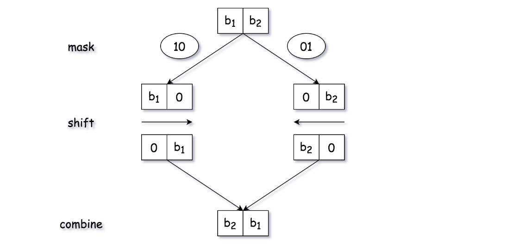

# Solution

## reverseBits

因 n 是 32-bit 的數字，首先取得 n 最右邊的 bit ，並把它左移 31 位後與 result 相加，最後在將 n 右移一位並重複該流程直到 n 為 0（左移的次數需遞減）。  

Q: 如何取得 n 最右邊的 bit
A: 利用 `&` 判斷，因為 `0 & 1 = 0` 、 `1 & 1 = 1` ，所以 `任何數 & 1` 就可以取得最右邊的 bit

Q: 為什麼第一次要左移 31 位
A: 因為 n 是 32-bits

### Dry Run

以 4-bits 的 5 示範。  

```
循環1
n = 0101 (5)
result = 0000 (0)
power = 3 (左移的距離)

result = 0000 + (n & 1) << power  -> 1000
n = n > 1                         -> 0010
power = power - 1                 -> 2

循環2
n = 0010
result = 1000
power = 2 (左移的距離)

result = 1000 + (n & 1) << power  -> 1000
n = n > 1                         -> 0001
power = power - 1                 -> 1

循環3
n = 0001
result = 1000
power = 1 (左移的距離)

result = 1000 + (n & 1) << power  -> 1010
n = n > 1                         -> 0000
power = power - 1                 -> 0

因 n = 0 所以直接回傳 result (1010 -> 10)
```
## reverseBits2

1. 將 32-bits 分成兩個 16 bit 的區塊在進行交換
2. 將 16-bits 分成兩個 8 bit 的區塊在進行交換
3. 持續分成兩個區塊直到區分出來的區塊為 1 bit
4. 在上述步驟中，我們將中間結果合併成一個整數作為下一循環的 input

  

我們用 **OR** 將兩個 bit 區塊合併
|A|B|A\|B|
|:---:|:---:|:---:|
|0|0|0|
|1|0|1|
|0|1|1|
|1|1|1|

### Dry Run

n = abcdefghijklmnopqrstuvwxyzABCDEF(*假設字母都代表 1*)
首先先將 n 分成兩個 16-bits 的區塊並交換它再重組起來 
```
abcdefghijklmnop qrstuvwxyzABCDEF
將第一區塊向右位移 16（一半），而第二區塊向左位移 16
並用 `OR` 將其組合起來會變成
qrstuvwxyzABCDEF abcdefghijklmnop
```  

將 16-bits 區塊分成兩個 8-bits 的區塊並交換它再重組起來
```
 qrstuvwx yzABCDEF abcdefgh ijklmnop
&11111111 00000000 11111111 00000000(0xff00ff00)
---------------------------------
 qrstuvwx 00000000 abcdefgh 00000000

 right shift 8 -> 00000000qrstuvwx00000000abcdefgh

 qrstuvwx yzABCDEF abcdefgh ijklmnop
&00000000 11111111 00000000 11111111(0x00ff00ff)
---------------------------------
 00000000 yzABCDEF 00000000 ijklmnop
 << 8
 變成 yzABCDEF00000000ijklmnop00000000

 透過 `OR` 組合變成
 yzABCDEFqrstuvwxijklmnopabcdefgh
```  

將 8-bits 區塊分成兩個 4-bits 的區塊並交換它再重組起來
```
 yzAB CDEF qrst uvwx ijkl mnop abcd efgh
&1111 0000 1111 0000 1111 0000 1111 0000(0xf0f0f0f0)
---------------------------------
 yzAB 0000 qrst 0000 ijkl 0000 abcd 0000
 >> 4 變成
 0000yzAB0000qrst0000ijkl0000abcd

 yzAB CDEF qrst uvwx ijkl mnop abcd efgh
&0000 1111 0000 1111 0000 1111 0000 1111(0x0f0f0f0f)
---------------------------------
 0000 CDEF 0000 uvwx 0000 mnop 0000 efgh
 << 4 變成
 CDEF0000uvwx0000mnop0000efgh0000

透過 `OR` 組合變成
CDEFyzABuvwxqrstmnopijklefghabcd
```  

將 4-bits 區塊分成兩個 2-bits 的區塊並交換它再重組起來
```
 CD EF yz AB uv wx qr st mn op ij kl ef gh ab cd
&11 00 11 00 11 00 11 00 11 00 11 00 11 00 11 00(0xcccccccc)
---------------------------------
 CD 00 yz 00 uv 00 qr 00 mn 00 ij 00 ef 00 ab 00
 >> 2 變成
 00CD00yz00uv00qr00mn00ij00ef00ab 

 CD EF yz AB uv wx qr st mn op ij kl ef gh ab cd
&00 11 00 11 00 11 00 11 00 11 00 11 00 11 00 11(0x33333333)
---------------------------------
 00 EF 00 AB 00 wx 00 st 00 op 00 kl 00 gh 00 cd
 << 2 變成
 EF00AB00wx00st00op00kl00gh00cd00

 透過 `OR` 組合變成 
 EFCDAByzwxuvstqropmnklijghefcdab
```   

將 2-bits 區塊分成兩個 1-bits 的區塊並交換它再重組起來
```
 E F C D A B y z w x u v s t q r o p m n k l i j g h e f c d a b
&1 0 1 0 1 0 1 0 1 0 1 0 1 0 1 0 1 0 1 0 1 0 1 0 1 0 1 0 1 0 1 0(0xaaaaaaaa)
---------------------------------
 E 0 C 0 A 0 y 0 w 0 u 0 s 0 q 0 o 0 m 0 k 0 i 0 g 0 e 0 c 0 a 0
 >> 1 變成
 0E0C0A0y0w0u0s0q0o0m0k0i0g0e0c0a 

 E F C D A B y z w x u v s t q r o p m n k l i j g h e f c d a b
&0 1 0 1 0 1 0 1 0 1 0 1 0 1 0 1 0 1 0 1 0 1 0 1 0 1 0 1 0 1 0 1(0x55555555)
---------------------------------
 0 F 0 D 0 B 0 z 0 x 0 v 0 t 0 r 0 p 0 n 0 l 0 j 0 h 0 f 0 d 0 b
 << 1 變成
 F0D0B0z0x0v0t0r0p0n0l0j0h0f0d0b0

透過 `OR` 組合變成
FEDCBAzyxwvutsrqponmlkjihgfedcba
```

## Reference

- [video](https://www.youtube.com/watch?v=-5z9dimxxmI&t=896s)   
