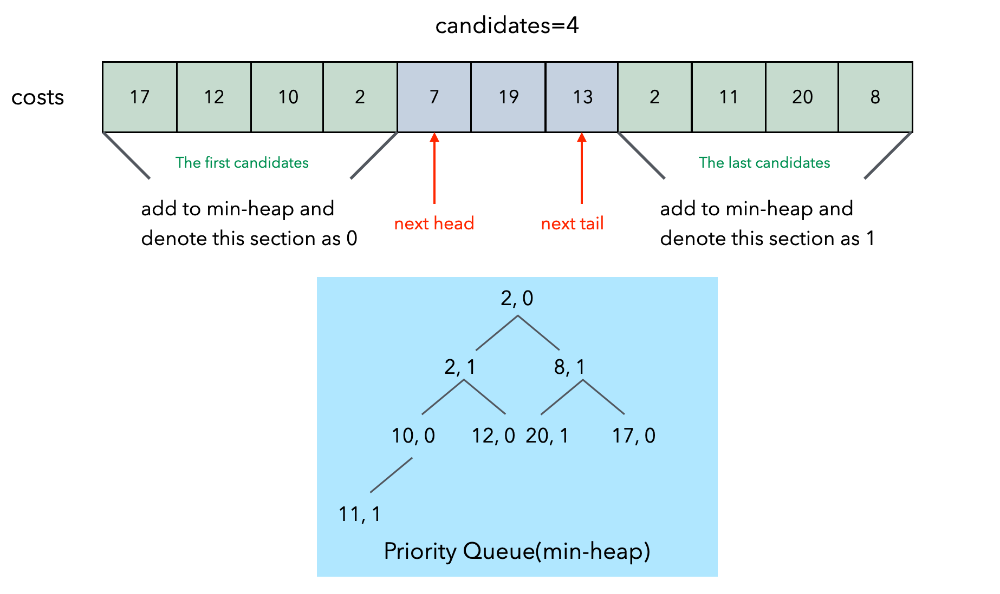
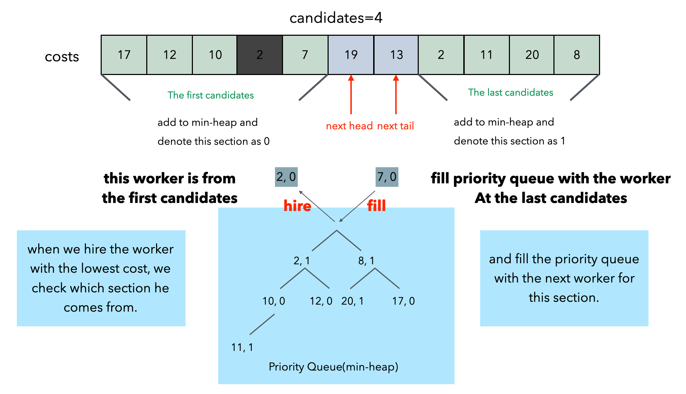

# Solution

## Priority Queue

we can add a new field to each worker to denote their section id. for instance, we can assign 0 to the first m candidates and 1 to the last m candidates. this way, when two workers have the same cost, the priority queue can sort them based on their section ids, and the worker with the smaller section id will be hired. this approach fully meets the requirements given in the problem.  

  

As illustrated in the following picture, we store each candidate in the priority queue(min heap), in the format of `(cost[i], section id)`. for example:  
- `costs[1] = 12` is from the head section(the first candidates) and stored as `(12, 0)`
- `costs[10] = 8` is from the tail section(the last candidates) and stored as `(8, 1)`  

We will proceed with the hiring process for k rounds by hiring the top worker from priority queue each time. similar to the previous solution:  
> if we choose a worker from `head section`, we add the worker at `next head` to `head section`.  
> if we choose a worker from `tail section`, we add the worker at `next tail` to `tail section`.  

Here, we check whether the hired worker is from the first candidates or the last candidates by checking his section id.  
> if the section id is `0`, it means that the worker is from the first candidates, we add the worker at `next head` to `priority queue` with a section id as `0`.   
> if the section is is `1`, it means that the worker is from the last candidates, we add the worker at `next tail` to `priority queue` with a section as `1`.  

  
