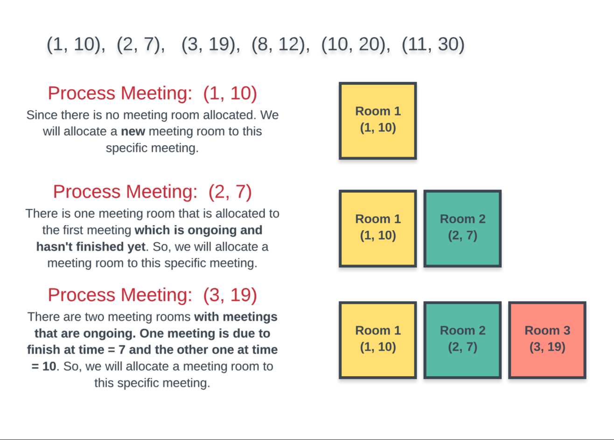
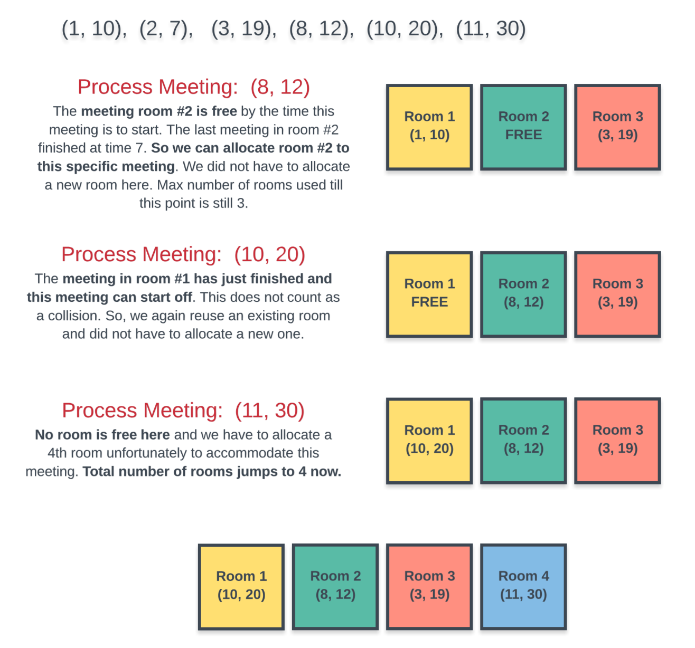
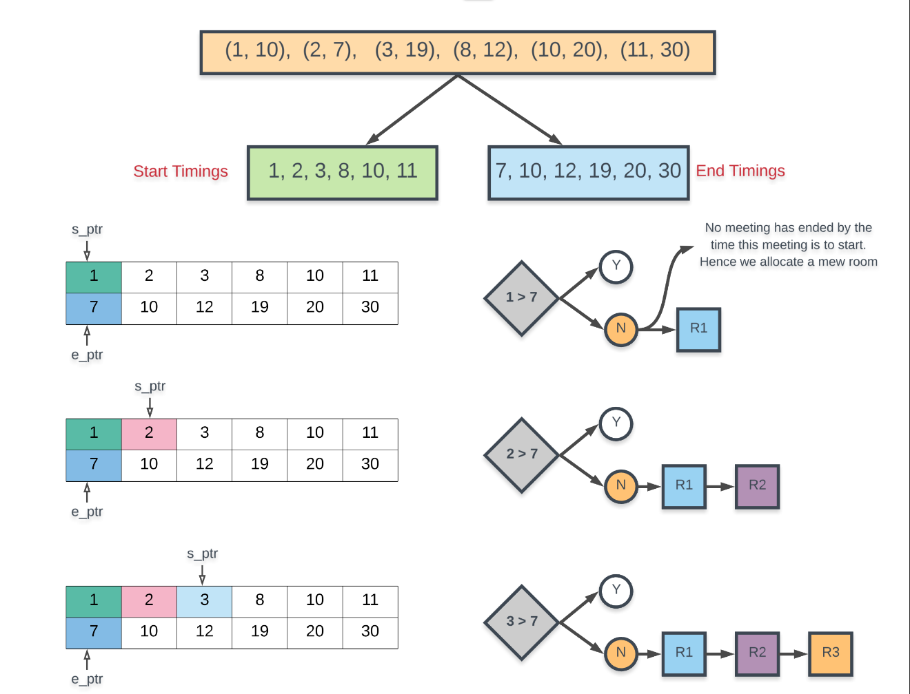
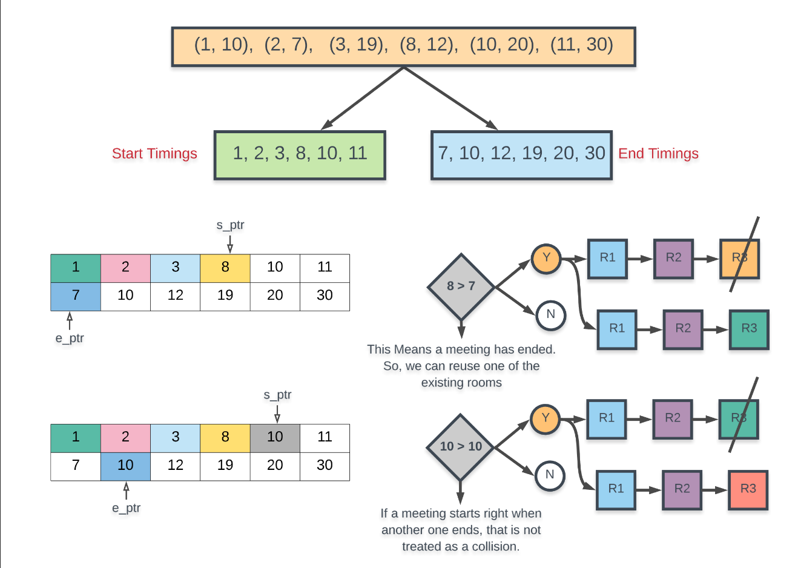
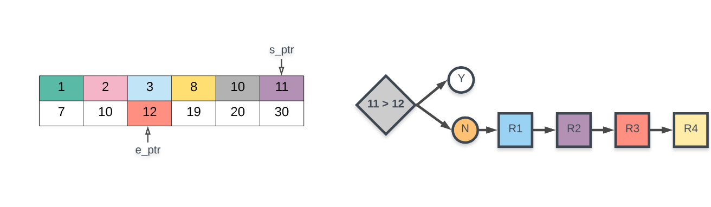

# Solution

## Priority Queue

We cannot really process the given meetings in any random order. the most basic way of processing the meeting is increasing order of their `start times` and this is the order we will follow. after all, it makes sense to allocate a room to the meeting that is scheduled for 9 a.m. in the morning before you worry about the 5 p.m. meeting, right?  

Let's go a dry run of an example problem with sample meeting times and see what our algorithm should be able to do efficiently.  

We will consider the following meeting times for our example `[1, 10], [2, 7], [3, 19], [8, 12], [10, 20], [11, 30]`. the first part of the array is the start time for the meeting and the second value represents the ending time. we are considering the meetings in a sorted order of their start times. the first diagram depicts the first three meetings where each of them requires a new room because of collisions.  

  

The next 3 meetings start to occupy some of the existing rooms. however, the last one requires a new room altogether and overall we have to use 4 different rooms to accommodate all the meetings.  

  

Sorting part is easy, but for every meeting how do we find out efficiently if a room is available or not? at any point in time we have multiple rooms that can be occupied and we don't really care which room is free as long as we find one when required for a new meeting.  

A naive way to check if a room is available or not is to iterate on all rooms and see if one is available when we have a new meeting at hand.  
> However, we can do better than this by making use of Priority Queue or the Min-Heap data structure.  

Instead of manually iterating on every room that's been allocated and checking if the room is available or not, we can keep all the room in a min heap where the key for the min heap would be the end time of meeting.  

So, every time we want to check if any room is free or not, simply check the topmost element of the min heap as that would be the room that would get free the earliest out of all the other rooms currently occupied.  

If the room we extracted from the top of the min heap isn't free, then `no other room is`. so, we can save time here and simply allocate a new room.  

## Chronological Order

The meeting timings given to us define a chronological order of events throughout the day. we are given the start and end timings for the meetings which can help us define this ordering.  

Arranging the meetings according to their start times helps us know the natural order of meetings throughout the day. however, simply knowing when a meeting starts doesn't tell us much about its duration.  

We also need the meetings sorted by their ending times because an ending event essentially tells us that there must have been a corresponding starting event and more importantly, an ending event tell us that a previously occupied room has now become free.  

A meeting is defined by its start and end times. however, for this specific algorithm, we need to treat the start and end times `individually`. this might not make sense right away because a meeting is defined by its start and end times. if we separate the two and treat them individually, then the identity of a meeting goes away. this is fine because:  
> When we encounter an ending event, that means that some meeting that started earlier has ended now. we are not really concerned with which meeting has ended. all we need is that some meeting ended thus making a room available.  

Let us consider the same example as we did in the last approach. we have the following meetings to be scheduled: `[1, 10], [2, 7], [3, 19], [8, 12], [10, 20], [11, 30]`. as before, the first diagram show us that the first three meetings are colliding with each other and they have to be allocated separate rooms.  

  

The next two diagrams process the remaining meetings and we see that we can now reuse some of the existing meeting rooms. the final result is the same, we need 4 different meeting rooms to process all the meetings. that's the best we can do here.  

  
  
