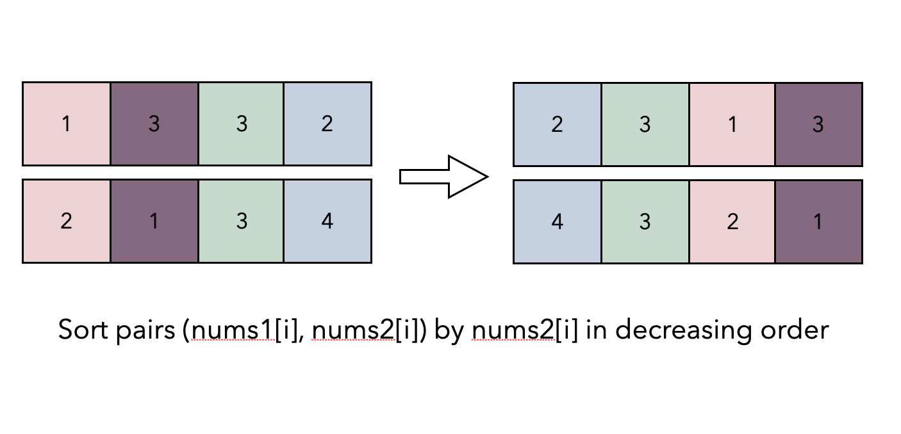

# Solution

## Priority Queue

Let's first focus on the minimum of the selected elements from nums2. if we pick nums2[i] as the minimum, it means the other k-1 selected elements from nums2 are larger or equal to nums2[i].  

We can thus take advantage of this restriction on the selection by sorting nums2, which can reduce the time complexity. assume that we have sorted nums2 by decreasing order(note that we cannot change the relative order of nums1 and nums2, so its better to store each pair as (nums1[i], nums2[i]) and sort the collection of pairs according to nums2[i]).  

As shown in the picture below, if we pick nums2[i](color in red) as the minimum selected element from nums2, we can freely select the rest k-1 indexes to the left of i without changing the second term: minimum of the selected elements from nums2.  

  

Recall the definition of the score, the second term has been fixed as nums2[i], so we can maximize the total score by maximizing the first term, that is, by selecting the maximum k elements from nums1 including nums1[i].  

  

This can be done efficiently by maintaining a min-heap that always contains the largest k elements we have seen. whenever we pick a new nums2[i] as the minimum from nums2, we shall remove one element from the heap which represents removing a nums1 number and add nums1[i] to it. now the heap contains the largest k element including nums1[i] again, the current score equals the sum of this heap times nums2[i].  

We can iterate over nums2 and repeat the above process. at each step, we calculate the current score and update answer as the maximum score we have met.  

Take the following slides as an example:

  
  
  
