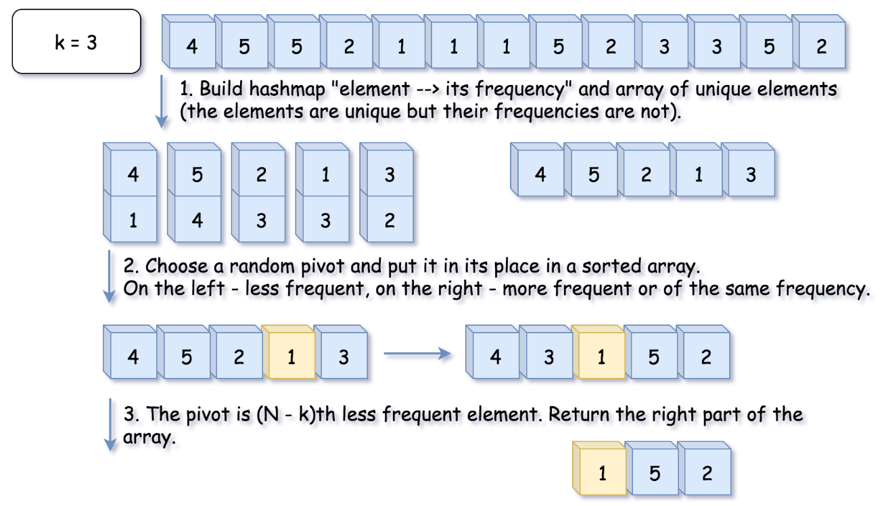
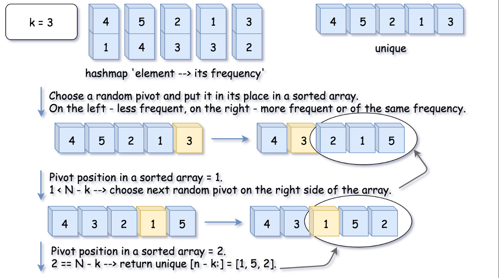

# Solution

## Quick Select

Quick Select is typically used to solve the problems "find `k`*th* something": `k`*th* smallest, `k`*th* largest, `k`*th* most frequent, `k`*th* less frequent.  

It has `O(N)` average time complexity and is widely used in practice. it is worth noting that its worst-case time complexity is `O(N²)`, although the probability of this worst-case is negligible.  

The approach is the same as for quick sort.
> One chooses a pivot and define its position in a sorted array in a linear time using the so-called partition algorithm.  

As an output, we have an array where the pivot is in its perfect position in the ascending sorted array, sorted by frequency. all elements on the left of the pivot are less frequent than the pivot, and all elements on the right are more frequent or have the same frequency.  

Hence the array is now split into two parts. if by chance our pivot element took `N - k`*th* final position, then `k` elements on the right are these top `k` frequent we're looking for. if not, we can choose one more pivot and place it in ths perfect position.

  

If that were a quick select algorithm, one would have to process both parts of the array. that would result in `O(N long N)` time complexity. in this case, there is no need to deal with both parts since one knows in which part to search for `N - k`*th* less frequent element, and that reduces the average time complexity to `O(N)`.  

### Algorithm

The algorithm is quite straightforward:
- Build a hash map `element -> its frequency` and convert its keys into the array `unique` of unique elements. note that elements are unique, but their frequencies are not. that means we need a partition algorithm that works fine with duplicates.  
- Work with `unique` array. use a partition scheme to place the pivot into its perfect position `pivot_index` in the sorted array, move less frequent elements to the left of the pivot, and more frequent or of the same frequency to the right.  
- Compare `pivot_index` and `N - k`.
  - if `pivot_index == (N - k)`, the pivot is `N - k`*th* most frequent element, and all elements on the right are more frequent or of the same frequency. return these top `k` frequent elements.  
  - Otherwise, choose the side of the array to proceed recursively.  

  

### Lomuto's Partition Scheme

There is a zoo of partition algorithms. the most simple one is [Lomuto's Partition Scheme](https://en.wikipedia.org/wiki/Quicksort#Lomuto_partition_scheme), and so is what we will use.  

Here is how it works:
- Move the pivot at the end of the array using swap.  
- Set the pointer at the beginning of the array `store_index = left`.
- Iterate over the array and move all less frequent elements to the left `swap(store_index, i)`. move `store_index` one step to the right after each swap.  
- Move the pivot to its final place, and return this index.  
