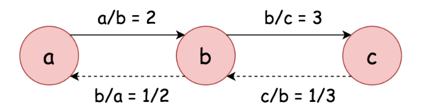
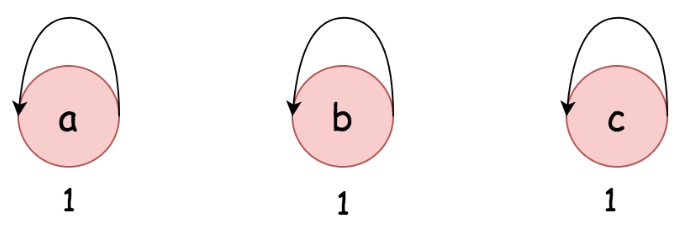
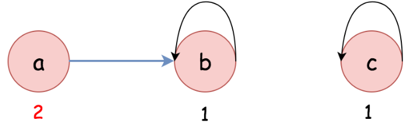
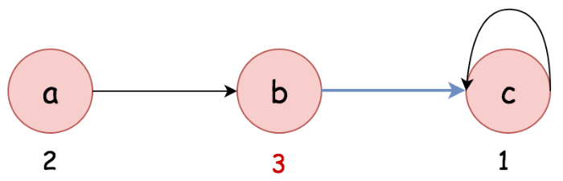
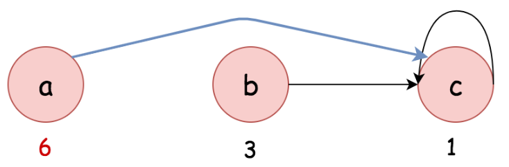

# solution

## Graph + DFS

依照 example1 得知 $\frac{a}{b} = 2,\frac{b}{c} = 3$  
若要計算 a/c 的值可以透過以下得知 $\frac{a}{b}\times\frac{b}{c} = 6$  

  

將被除數跟除數當成 vertex ，商當成 vertex（被除數）到 vertex（除數）的 edge 權重，藉此組成一個有向的圖，就可以依照被除數的 neighbors 去檢查是否能找到除數，並計算結果。  

## Union Find

Union Find 是由 union() 和 find() 兩個運算組成的。
- union(x, y): 合併兩個元素 x 和 y 所屬的組別。  
- find(x): 取得元素 x 所屬的組別資訊，並檢查元素 x 所屬的組別是否為 x ，如果不是就遞迴更新狀態。  

首先，我們透過 Union Find 建立一個圖，圖中的每個節點（被除數）都包含 parent（除數）與權重（quotient）。  
舉例來說，有一個節點 a 它在圖中為 `"a" -> {"a", 1}` ，第一個 a 代表節點，第二個 a 代表它所屬的組別，而 1 代表權重，等於 $\frac{a}{a} = 1$ 。  

根據上述定義，假設目前有兩個節點為 a 與 b 其資料為 `{a_group, a_weight}` 與 `{b_group, b_weight}` ，若要計算 $\frac{a}{b}=?$ 只需執行以下兩個計算：
- `a_group == b_group`: 如果相等，代表 a 與 b 屬於同一個組，它們之間相連。  
- `a_weight / b_weight`: 如果上述條件成立，透過它們對應的權重，我們可以得到 $\frac{a}{b}$ 的結果。  

我們來看一下 example1 $\frac{a}{b}=2, \frac{b}{c}=3$
- 最初，每個節點的資料如下所示，其中每個節點的 group 為節點本身，且權重為 1 ，每個節點都單獨形成一個組，因為它們之間目前沒有關係。  

  

- 現在我們透過合併（union 方法）兩個組（a 與 b）處理 $\frac{a}{b}=2$ ，我們會得到下圖的結果。  
  我們將被除數 a 的組別附加到除數 b 的組別，同時，我們也會更新 a 組的相對權重，以反映兩個節點的比率。

  

- 同樣的，我們透過合併（union 方法）b 組與 c 組來處理 $\frac{b}{c}=3$  
  我們將被除數 b 的組附加到除數 c 的組，且更新 b 組權重以反映兩組之間的比率。  

  

- 最後當我們對節點 a 呼叫 find() 時，將觸發連鎖反應來更新上一層的 group 與權重。  

> 因為 find() 中會檢查上一層 group 是否與當前 group 相同，若不相同則會持續往上一層查並更新權重，所以，一旦 find() 的**lazy evaluation** 被觸發，鏈上節點狀態就會被更新，最後變得一致。
