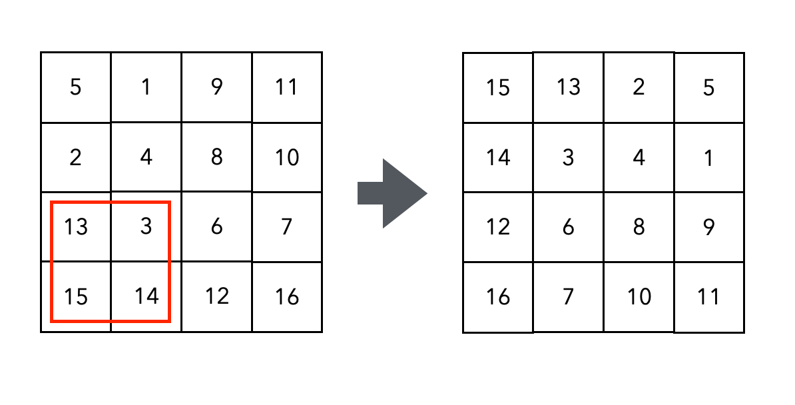
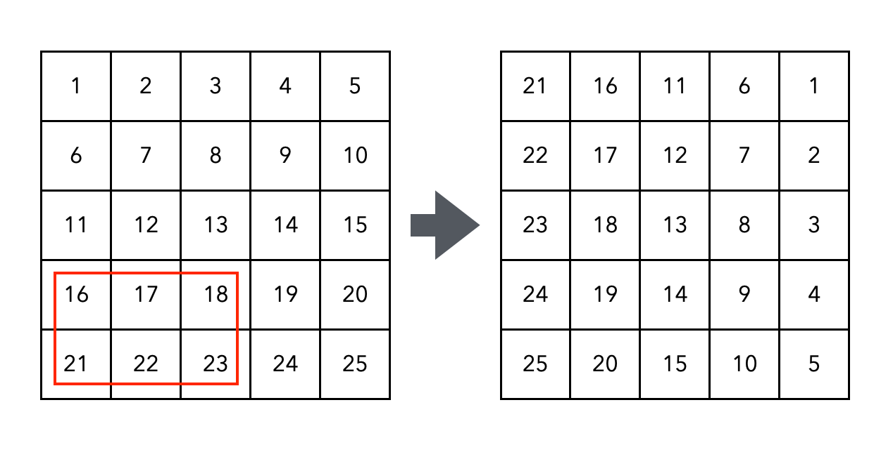
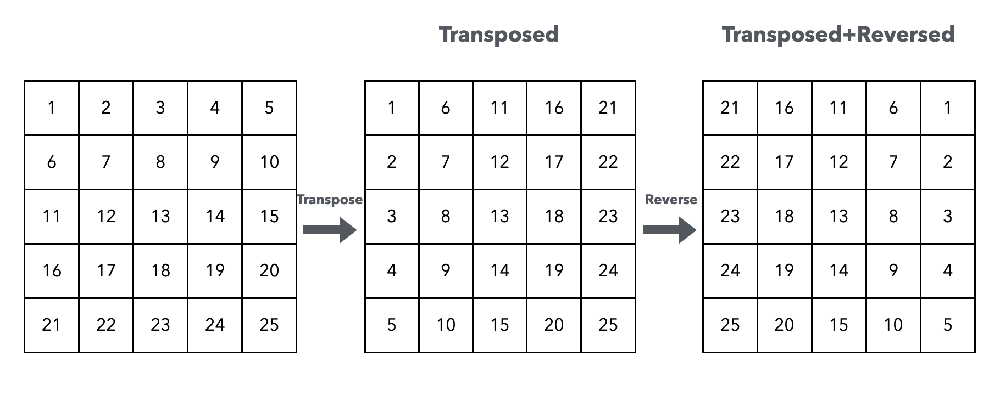

# Solution

## rotate

我們可以透過以下步驟完成 90 度的轉換
1. 先用變數 `temp` 儲存左下角的數字 `15`
2. 將右下角的數字換到左下角
3. 右上角換到右下角
4. 左上角換到右上角
5. 將 `temp` 的數字換到左上角

那我們接著觀察需要重複上述的步驟多少次才能完成所有數字的轉換呢？  

如果 matrix 是一個 4 x 4 的正方形，如果將他平分成四小塊，那每一小塊就是一個 2 x 2 的方塊，只要執行 2*2 次就可以完成所有數字的轉換。  
轉換的數字順序為 `15 -> 13 -> 14 -> 3`  

  

那如果 matrix 是一個 5 x 5 的正方形呢，我們需要重複 3*2 次才能完成所有數字的轉換。  
轉換的數字順序為 `12 -> 16 -> 22 -> 17 -> 23 -> 18`  

  

我們可以由上述奇數長度與偶數長度 matrix 的範例找出規律，迴圈的次數應是 `(n+1)/2 * (n/2)`  

## rotate2

旋轉矩陣最優雅的解決方案是先圍繞著主對角線反轉矩陣，然後從左到右反轉。這些運算在線性代數中稱為 `transpose` 與 `reflect`。  

  

儘管這個方法的讀取和寫入次數是 `rotate` 方法1的兩倍，但大多數人會認為它是更好的方法，因為程式碼更為簡單。  
