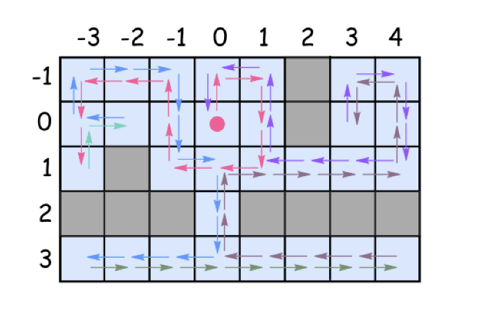

# Solution

## Spiral Backtracking

this solution is based on the same idea as the solving algorithm called [right-hand rule](https://en.wikipedia.org/wiki/Maze_solving_algorithm#Wall_follower). go forward, cleaning and marking all the cells on the way as visited. at the obstacle turn right, again to forward, etc. always turn right at the obstacles and then go forward. consider already visited cells as virtual obstacles.

> what to do if, after the right turn, there is an obstacle just in front?

turn right again.

> how to explore the alternative path from the cell?

go back to that cell and then turn right from your last explored direction.

> when to stop?

stop when you explored all possible path. i.e. all 4 directions(up, right, down, and left) for each visited cell.

### Algorithm

- mark the cell as visited and clean it up.
- explore 4 directions: up, right, down, and left (the order is important since the idea is always to turn right):
  - check the next cell in the chosen direction:
    - if it's not visited yet and there are no obstacles:
      - more forward.
      - explore next cells.
      - backtrack. i.e. go back to the previous cell.
    - turn right because now there is an obstacle(or a virtual obstacle) just in front.

  
