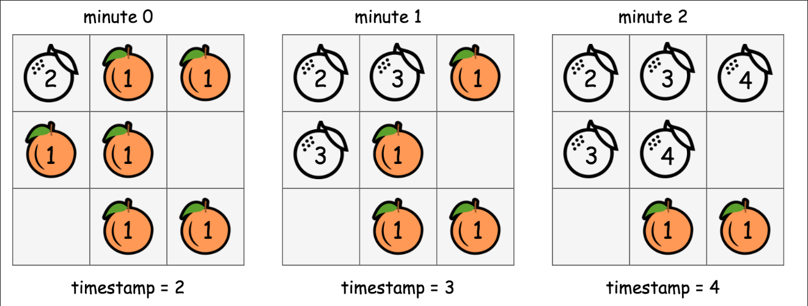
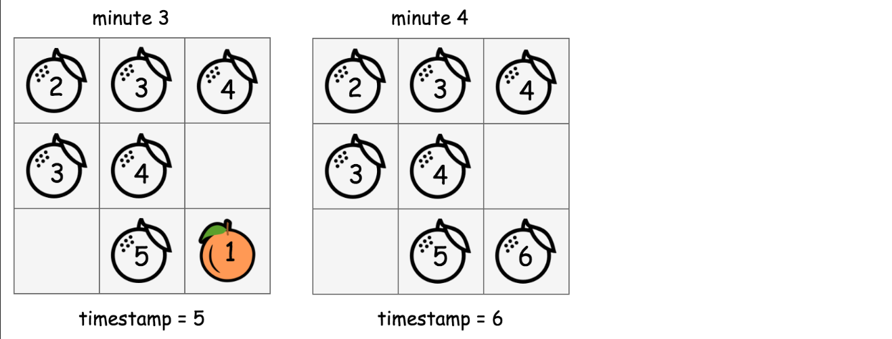

# Solution

## In-Place BFS

解決這個問題的最佳策略是 BFS ，但論壇中的一些用戶提出了 BFS 具有恆定空間複雜度 O(1) 的不同實例。  
僅舉幾個例子，如 [@manky](https://leetcode.com/problems/rotting-oranges/solutions/569248/Alternate-approach-BFS-O(N-*-Height)-but-constant-space-easy-to-understand-and-modular-code/) 和 [@votrubac](https://leetcode.com/problems/rotting-oranges/discuss/238579/C%2B%2BJava-with-picture-BFS)。  

若參考 `orangesRotting` BFS 和 queue 的實現，它的空間複雜度主要是因為 queue ，我們要用它來保持存取 cells 的順序，為了實現 O(1) 的空間複雜度，我們不用 queue 而是直接修改 grid 用來標記腐爛的橘子，而不是使用額外的存取表（queue）。  

  
  

透過上圖展示如何就地修改 grid 的值來運行 BFS 。  
1. 從 timestamp = 2 開始，因為被標記為 2 的網格代表腐爛的橘子。這一刻，本輪 BFS 應該只存取具有 timestamp 的網格（grid[i][j] == timestamp）  
2. 對於每個標記為當前 timestamp 的 cell ，我們繼續用下一個 timestamp（timestamp += 1） 標記其有新鮮橘子的相鄰 cell 。這種就地修改標記的目的與先前用 queue 的目的相同，都是為了選擇下一輪要存取的候選者（即擁有新鮮橘子的相鄰 cell）。  
3. 這時我們的 timestamp = 3 ，同時我們也標記出本輪要存取的 cell ，然後我們重複步驟 2 直到步驟 2 不會在產生新的候選者（即 BFS 遍歷結束）。  
